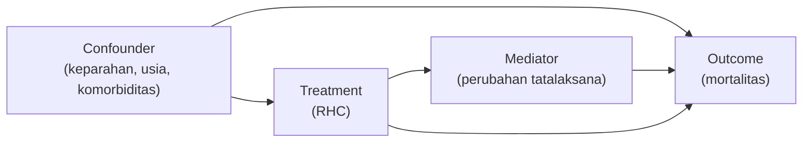

# 2. Skema Kausal & Variabel (DAG) — Detail

<aside>
🧭

Inilah **skema detail** proyek ini — padanan "skema entitas" di proyek NLP. Di causal inference, skema = **definisi variabel kausal + DAG (Directed Acyclic Graph) + asumsi identifikasi**. Dokumen ini WAJIB jadi acuan sebelum estimasi apa pun.

</aside>

## 1. Peran variabel kausal

| Peran | Simbol | Definisi | Contoh (kasus RHC) |
| --- | --- | --- | --- |
| **Treatment / Exposure** | T | Variabel "penyebab" yang ingin diukur efeknya | Pemasangan RHC (ya/tidak) |
| **Outcome** | Y | Hasil yang ingin dijelaskan | Mortalitas 30 hari (ya/tidak) |
| **Confounder** | X | Memengaruhi T DAN Y — sumber bias utama, WAJIB disesuaikan | Tingkat keparahan penyakit, usia, komorbiditas |
| **Mediator** | M | Berada di jalur T → M → Y — JANGAN disesuaikan bila ingin efek total | Perubahan tatalaksana akibat RHC |
| **Collider** | C | Dipengaruhi T DAN Y — menyesuaikannya JUSTRU menimbulkan bias | Status dirujuk ke spesialis |
| **Instrument** | Z | Memengaruhi T tapi tidak langsung ke Y — untuk metode IV | (opsional) variasi praktik antar-RS |

## 2. DAG (Directed Acyclic Graph)

DAG menggambarkan asumsi sebab-akibat secara eksplisit. Contoh DAG untuk kasus RHC:

> **Cara membaca:** Untuk mengukur efek kausal T → Y secara benar, kita harus "menutup" jalur belakang (*backdoor*) T ← X → Y dengan menyesuaikan X. Jalur T → M → Y adalah bagian dari efek total, jadi M **tidak** disesuaikan (kecuali ingin efek langsung saja).
> 

## 3. Estimand (apa yang diestimasi)

| Estimand | Arti | Kapan dipakai |
| --- | --- | --- |
| **ATE** | Average Treatment Effect — efek rata-rata di seluruh populasi | Pertanyaan kebijakan umum |
| **ATT** | Effect on the Treated — efek pada yang benar-benar diberi treatment | Saat fokus pada penerima treatment |
| **CATE** | Conditional ATE — efek pada subkelompok tertentu | Analisis heterogenitas (mis. per usia) |

## 4. Asumsi identifikasi (WAJIB dinyatakan & diuji)

- **Unconfoundedness / Ignorability** — semua confounder penting telah diukur & disesuaikan (tidak ada confounder tersembunyi).
- **Positivity / Overlap** — setiap subjek punya peluang > 0 menerima maupun tidak menerima treatment (cek distribusi propensity score).
- **SUTVA** — treatment satu subjek tidak memengaruhi outcome subjek lain; treatment terdefinisi konsisten.
- **Consistency** — outcome teramati = outcome potensial di bawah treatment yang diterima.

## 5. Daftar variabel konkret (template diisi saat EDA)

| Nama variabel | Peran (T/Y/X/M/C) | Tipe | Catatan |
| --- | --- | --- | --- |
| `swang1` (RHC) | T | Biner | Treatment utama |
| `death` | Y | Biner | Outcome utama |
| `age`, `sex`, `apache score`, ... | X | Numerik/kategorik | Confounder — daftar lengkap diisi saat EDA |
| ... | ... | ... | ... |

<aside>
⚠️

**Kesalahan umum yang harus dihindari:** (1) menyesuaikan **mediator** atau **collider** (menimbulkan bias), (2) mengabaikan **overlap** (estimasi tidak valid di area tanpa overlap), (3) mengklaim kausalitas tanpa menyatakan asumsi & tanpa uji refutasi.

</aside>