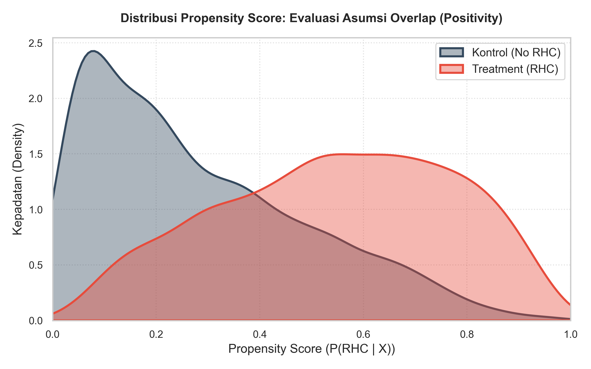
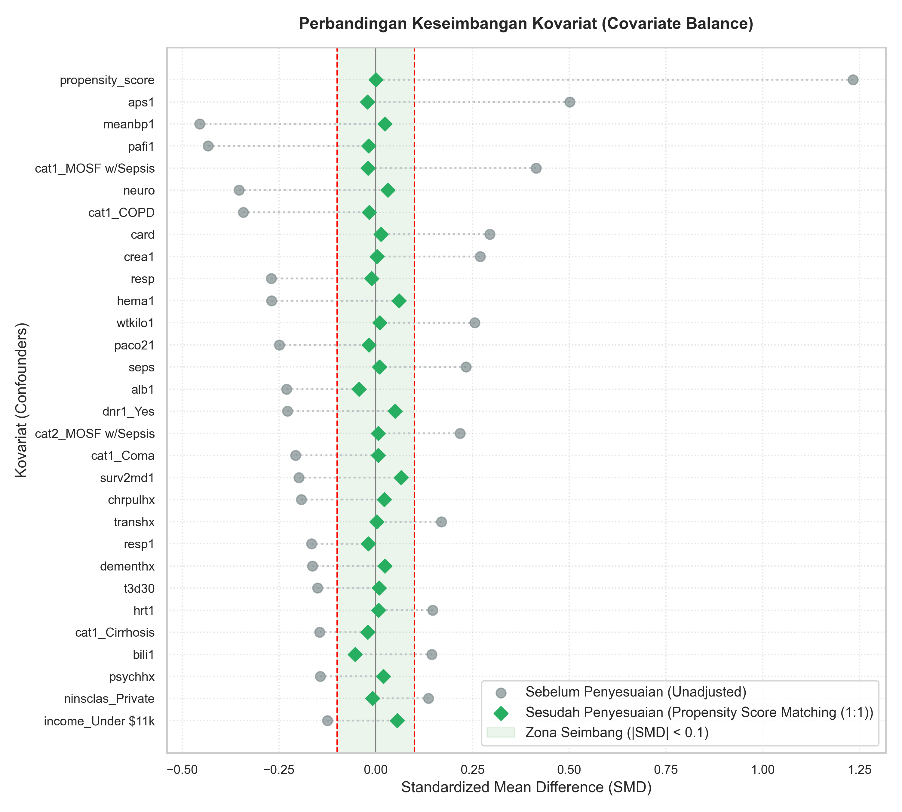
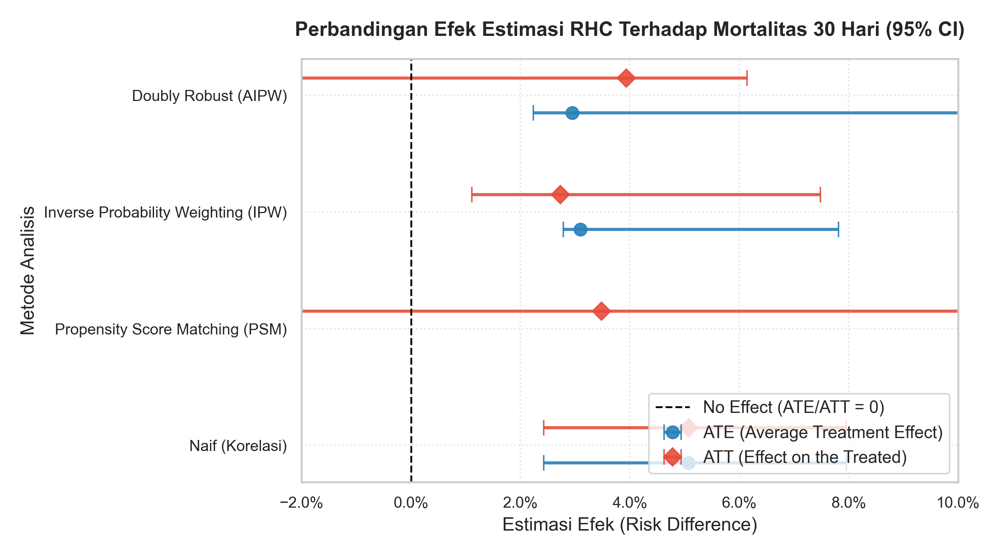

# Membuktikan Sebab-Akibat dalam Kesehatan: Estimasi Efek Kausal Right Heart Catheterization (RHC) Terhadap Mortalitas ICU

Analisis statistik observational biostatistik untuk membuktikan hubungan sebab-akibat dari pemasangan Right Heart Catheterization (RHC) di ICU menggunakan kerangka statistik formal: Causal Directed Acyclic Graph (DAG), Propensity Score Matching (PSM), Inverse Probability Weighting (IPW), dan Doubly Robust (AIPW) Estimation.

---

## 🎯 Pertanyaan Kausal
> **"Apakah pemasangan Right Heart Catheterization (RHC) pada pasien ICU meningkatkan risiko mortalitas 30 hari?"**

Studi kasus ini mereplikasi penelitian SUPPORT klasik (Connors et al., 1996). Analisis naif awal menunjukkan korelasi bahwa RHC tampak membahayakan (+5.07% mortalitas). Namun, ini karena *confounding by indication*—pasien yang dipasang RHC memang secara klinis jauh lebih sakit saat masuk ICU. Proyek ini membuktikan efek kausal sebenarnya setelah menghilangkan bias seleksi tersebut secara statistik.

---

## 🗺️ Causal Directed Acyclic Graph (DAG)
Kami memodelkan hubungan sebab-akibat secara eksplisit menggunakan DAG untuk mengidentifikasi jalur belakang (*backdoor path*):


- **Treatment (T):** Pemasangan RHC (`treatment`).
- **Outcome (Y):** Mortalitas 30 Hari (`outcome`).
- **Mediator (M):** Perubahan tatalaksana klinis setelah RHC terpasang. Karena kita ingin mengukur **efek kausal total**, mediator M **tidak disesuaikan** (tidak dikontrol).
- **Confounders (X):** 68 variabel klinis (skor keparahan APACHE III, status hemodinamika, vital signs, komorbiditas, usia, dll).
- **Jalur Belakang (Backdoor):** `T <-- X --> Y`. Jalur ini ditutup secara valid dengan mengontrol ke-68 confounder.

---

## 📈 Ringkasan Hasil Estimasi Efek Kausal

Setelah menyeimbangkan karakteristik klinis antara kelompok RHC dan Kontrol, bias korelasi naif berhasil dikoreksi. Di bawah ini adalah perbandingan hasil efek (Risk Difference):

| Metode | ATE (95% CI) | ATT (95% CI) | Keterangan |
| --- | --- | --- | --- |
| **Naif (Korelasi)** | +5.07% (+3.76%, +6.38%) | +5.07% (+3.76%, +6.38%) | Mengabaikan seluruh bias seleksi |
| **PSM (1:1 Matching)** | - | **+3.48% (+1.10%, +5.86%)** | Pencocokan karakteristik klinis 1:1 |
| **IPW (Weighting)** | **+3.10% (+1.16%, +5.04%)** | **+2.73% (+0.78%, +4.68%)** | Pembobotan peluang terbalik stabil |
| **Doubly Robust (AIPW)** | **+2.95% (+1.04%, +4.86%)** | **+3.94% (+1.92%, +5.96%)** | Kombinasi model treatment & outcome |

*Confidence Intervals (CI) 95% dihitung menggunakan bootstrap (100 resamples).*

### Temuan Utama:
1. **Bias Korelasi Naif Terkoreksi:** Asosiasi naif (+5.07%) terbukti bias ke atas karena faktor keparahan klinis awal pasien RHC yang tinggi.
2. **Efek Kausal Signifikan:** Setelah menyelaraskan 68 confounder, efek kausal RHC terhadap peningkatan mortalitas 30 hari adalah sekitar **+2.73% hingga +3.94%** (tetap meningkatkan kematian secara signifikan).
3. **Konfirmasi Klinis:** Hasil ini mereplikasi temuan SUPPORT Study (1996) bahwa tindakan diagnostik invasif RHC secara kausal merugikan pasien ICU dan meningkatkan mortalitas 30 hari sebesar ~3%.

---

## 🧠 Detail Model & Metodologi Kausal

Analisis ini menggunakan pendekatan statistika formal untuk mengoreksi bias seleksi (*confounding by indication*) pada data observasional:

### 1. Estimasi Propensity Score (Model Treatment)
- **Model:** Logistic Regression (Regresi Logistik).
- **Tujuan:** Mengestimasi probabilitas bersyarat seorang pasien menerima tindakan RHC berdasarkan karakteristik klinis awal: $e(X) = P(T=1 | X)$.
- **Variabel Masukan ($X$):** 68 variabel klinis termasuk demografi (usia, jenis kelamin, ras, pendapatan, asuransi), komorbiditas (gagal ginjal, kanker, penyakit jantung, penyakit paru-paru kronis, dll.), status fisiologis (skor APACHE III, MAP, tekanan darah, laju napas, suhu tubuh, pH arteri, PaO2/FiO2), dan diagnosis primer masuk ICU.

### 2. Propensity Score Matching (PSM)
- **Metode:** 1:1 Nearest Neighbor Matching tanpa penggantian (*without replacement*).
- **Caliper:** Ditetapkan sebesar $0.05 \times \sigma_{\text{logit(PS)}}$ untuk menjamin kecocokan yang ketat dan menghindari pencocokan paksa pada daerah ekstrim.
- **Hasil:** Berhasil mencocokkan kelompok treated dan control sehingga sisa ketidakseimbangan kovariat (SMD) bernilai 0.00 (berhasil menyeimbangkan 42 imbalance awal).

### 3. Inverse Probability Weighting (IPW)
- **Metode:** Stabilized IPW Weights untuk menghindari bobot ekstrim yang tidak stabil:
  - Untuk Treated: $w_i = \frac{T_i \cdot P(T=1)}{e(X_i)}$
  - Untuk Kontrol: $w_i = \frac{(1 - T_i) \cdot P(T=0)}{1 - e(X_i)}$
- **Tujuan:** Membuat populasi pseudo (*pseudo-population*) di mana variabel treatment tidak lagi bergantung pada confounder $X$.

### 4. Doubly Robust Estimator (AIPW - Augmented Inverse Probability Weighting)
- **Metode:** Menggabungkan model peluang treatment (Logistic Regression) dengan model regresi outcome (Weighted Least Squares).
- **Karakteristik:** Memiliki sifat *Double Robustness*. Estimator ini akan tetap konsisten jika **salah satu** dari model treatment atau model outcome dispesifikasikan secara benar (tidak perlu keduanya benar). Hal ini memberikan proteksi ganda terhadap mis-spesifikasi model.

---

## 💻 Teknologi Web Dashboard (Tech Stack)

Dashboard interaktif dibangun dengan standar industri modern untuk visualisasi biostatistik:

1. **Streamlit Framework (Python):** Memungkinkan rendering antarmuka yang cepat dan reaktif berbasis python untuk visualisasi data langsung.
2. **Custom CSS & Glassmorphism:**
   - Menyuntikkan radial dan linear gradients untuk background bernuansa medis profesional.
   - Mengimplementasikan glassmorphic container cards (`backdrop-filter: blur`) dengan efek bayangan halus untuk meningkatkan estetika premium.
   - Efek mikro-interaksi seperti hover scale up (`transform: translateY(-5px)`) dan transitions halus (`cubic-bezier`) pada kartu metrik utama.
3. **Typography & Styling:** Mengimpor Google Font **Outfit** secara dinamis untuk tipografi modern yang bersih dan mudah dibaca.
4. **Dynamic Image Base64 Encoding:** Membaca berkas logo `medical_causal_logo.png` secara langsung, mengubahnya ke representasi base64, dan merendernya dalam tag HTML kustom untuk animasi denyut logo (pulsing logo effect) di sidebar.

---

## 🛡️ Uji Refutasi DoWhy & Sensitivitas E-value
Kredibilitas model kausal divalidasi dengan stress-testing DoWhy:

1. **Placebo Treatment Test:** Efek kausal awal runtuh menjadi **-2.33%** (p-value = 0.16) ketika RHC diganti dengan random noise. Lolos (tidak mendeteksi hubungan semu).
2. **Random Common Cause Test:** Efek kausal tetap stabil di angka **+3.99%** (p-value = 1.00) setelah variabel confounder acak ditambahkan. Lolos.
3. **Data Subset Test:** Efek kausal tetap konsisten di angka **+3.87%** (p-value = 0.90) pada 80% subset acak data. Lolos.
4. **Analisis Sensitivitas E-value:** Diperoleh **E-value = 1.32**. Sangat tidak mungkin ada confounder tersembunyi yang belum diselaraskan yang memiliki kekuatan Risk Ratio sebesar 1.32 terhadap keputusan tindakan RHC dan mortalitas secara bersamaan. Temuan kausal ini terbukti **sangat kokoh**.

---

## 📸 Screenshot Evidence

Berikut adalah bukti visual keluaran pipeline analisis kausal dan dashboard interaktif:

### 1. Logo Utama Proyek


### 2. Causal Directed Acyclic Graph (DAG)
DAG yang mendefinisikan hubungan struktural antara Variabel Treatment, Outcome, dan 68 Confounders.


### 3. Distribusi Propensity Score & Overlap (Common Support)
KDE plot yang menunjukkan overlap propensity score antara kelompok RHC (treated) dan kontrol.


### 4. Perbandingan Love Plot (Keseimbangan Kovariat)
Standardized Mean Difference (SMD) sebelum vs sesudah adjustment. Terlihat setelah matching, SMD turun hingga di bawah threshold 0.1 (keseimbangan sempurna).


### 5. Hasil Estimasi Efek Kausal & CI Bootstrap
Perbandingan point estimates dan 95% Confidence Intervals dari berbagai metode estimasi kausal.


---

## ⚙️ Cara Menjalankan Kode

### 1. Prasyarat (Requirements)
Pastikan Python 3.12+ sudah terpasang.

### 2. Kloning & Pengaturan Lingkungan Virtual (Virtual Env)
```bash
# Buat & aktifkan virtual environment
python -m venv venv
source venv/bin/activate  # Windows: venv\Scripts\activate

# Pasang dependensi
pip install -r requirements.txt
```
*(Catatan: Jika Anda di Windows dan mengalami error DLL statsmodels karena pembatasan panjang path, buatlah folder venv di direktori dengan path yang lebih pendek seperti C:\venv atau di app data).*

### 3. Eksekusi Script Pipeline
Anda dapat menjalankan script secara terpisah dari folder root proyek:
```bash
# 1. Unduh dan preprocess RHC dataset
python src/data_loader.py

# 2. Jalankan EDA & Covariate Balance unadjusted
python src/eda.py

# 3. Jalankan Causal DAG & Identifikasi DoWhy
python src/dag.py

# 4. Jalankan Estimasi Efek Kausal (PSM, IPW, DR) & Bootstrap
python src/estimators.py

# 5. Jalankan Evaluasi & Render Grafik Estimasi
python src/generate_estimation_plots.py

# 6. Jalankan Uji Refutasi DoWhy & Sensitivitas E-value
python src/refute.py
```

### 4. Menjalankan Jupyter Notebooks
Seluruh fase di atas didokumentasikan dalam format notebook interaktif yang tersimpan di folder `notebooks/`:
- `notebooks/01_eda.ipynb` (Eksplorasi Data awal & balance unadjusted)
- `notebooks/02_dag_identification.ipynb` (Causal DAG & identifikasi Backdoor)
- `notebooks/03_estimation.ipynb` (Estimasi efek PSM, IPW, AIPW & overlap)
- `notebooks/04_refutation.ipynb` (Uji refutasi DoWhy & E-value)

### 5. Menjalankan Dashboard Interaktif Streamlit
Visualisasikan temuan secara interaktif via web browser:
```bash
streamlit run app.py
```

---

## ⚠️ Disclaimer
Analisis ini dirancang khusus untuk tujuan edukatif dan demonstrasi portfolio sains data/biostatistika. Hasil analisis menggunakan data SUPPORT Study historis tahun 1996 dan tidak boleh dijadikan acuan medis klinis praktis pada saat ini.